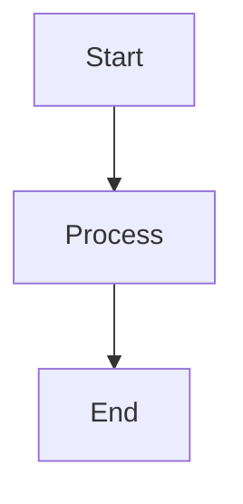

# ୧ʕ •ᴥ•ʔ୨ Bear Berry

[](https://github.com/Pagliacii/hugo-bearberry/actions/workflows/gh-pages.yml)
[](https://github.com/Pagliacii/hugo-bearberry/blob/main/LICENSE)
[](https://gohugo.io/)
[](https://pagliacii.github.io/hugo-bearberry)

## Overview

🐻 🍓 Bear Berry is a modern, feature-rich Hugo theme that's a significant enhancement of [Hugo Bear Cub](https://github.com/clente/hugo-bearcub). While maintaining the lightweight and minimal design philosophy, Bear Berry adds powerful features including multilingual support, dynamic social cards, advanced diagram rendering, and comprehensive SEO optimization.

Perfect for technical blogs, documentation sites, and personal websites that need both elegance and functionality.

**[🚀 Live Demo](https://pagliacii.github.io/hugo-bearberry)**

## Installation

### Quick Start

Follow Hugo's [quick start](https://gohugo.io/getting-started/quick-start/) to create an empty website, then install Bear Berry:

```bash
# Create new site
hugo new site my-blog
cd my-blog

# Install Bear Berry as submodule
git init
git submodule add https://github.com/Pagliacii/hugo-bearberry themes/hugo-bearberry

# Configure theme
echo 'theme = "hugo-bearberry"' >> hugo.toml
```

### GitHub Pages Deployment

Bear Berry works great with GitHub Pages! Use the [Hugo GitHub Action](https://github.com/peaceiris/actions-hugo):

1. **Create `.github/workflows/gh-pages.yml`**:
```yaml
name: Deploy Hugo site to Pages
on:
  push:
    branches: [main]

jobs:
  deploy:
    runs-on: ubuntu-latest
    steps:
      - uses: actions/checkout@v4
        with:
          submodules: recursive
          fetch-depth: 0
      - uses: peaceiris/actions-hugo@v2
        with:
          hugo-version: 'latest'
          extended: true
      - run: hugo --minify
      - uses: peaceiris/actions-gh-pages@v3
        with:
          github_token: ${{ secrets.GITHUB_TOKEN }}
          publish_dir: ./public
```

2. **Enable GitHub Pages** in repository settings

### Development Setup

For theme development or testing:

```bash
# Clone with submodules
git clone --recursive https://github.com/Pagliacii/hugo-bearberry
cd hugo-bearberry

# Start development server using exampleSite
hugo server --source ./exampleSite --themesDir ../.. --disableFastRender

# Build example site
hugo --source ./exampleSite --themesDir ../.. --cleanDestinationDir
```

## ✨ Features

### Content & Writing
- **Reading experience**: Shows update date, word count, and reading time on post pages
- **Table of contents**: Smart TOC with mobile-responsive design using tocbot
- **Copy functionality**: One-click copying for code blocks and markdown content
- **Back-to-top**: Smooth scrolling navigation button
- **Heading anchors**: Automatic heading links with "#" prefix

### Multilingual Support
- **4 languages**: English, Chinese (Simplified), German, Korean
- **Content mirroring**: Automatic content organization across languages
- **Language switcher**: Seamless navigation between translations
- **SEO-friendly**: Proper hreflang tags for international SEO

### Technical Features
- **Math rendering**: Choose between KaTeX and MathJax per post
- **Diagram support**: 
  - Mermaid.js for flowcharts, sequence diagrams, class diagrams
  - Kroki integration for 20+ diagram types (PlantUML, D2, C4, etc.)
- **Syntax highlighting**: Dracula-based theme with line numbers
- **Social cards**: Dynamic generation for posts without custom images
- **SEO optimization**: Structured data, meta tags, Open Graph, Twitter Cards

### Interactive Elements
- **Giscus comments**: GitHub-powered commenting system
- **Custom shortcodes**: 11 enhanced shortcodes for better content presentation
- **Responsive design**: Mobile-first approach with touch-friendly interactions
- **Theme styles**: Two built-in themes - "original" (Bear Cub style) and "herman" (modern)

### Performance & SEO
- **Fast loading**: Optimized assets and caching strategies
- **Social media**: Automatic Open Graph and Twitter Card generation
- **Search engines**: Robots.txt, sitemap.xml, structured data
- **PWA ready**: Web app manifest and service worker support

### AI & LLM Integration
- **llms.txt**: Automatic generation of structured content file for AI model consumption at `/llms.txt`
- **AI Navigation**: Complete site overview with titles, publish dates, tags, and content URLs
- **No Setup Required**: Enabled by default with smart link generation to markdown sources

## Configuration

### Basic Setup

Create a `hugo.toml` file in your site root:

```toml
baseURL = "https://yourdomain.com"
theme = "hugo-bearberry"
copyright = "Your Name © 2025"
defaultContentLanguage = "en"

# Essential features
enableRobotsTXT = true
enableGitInfo = true

# Syntax highlighting
[markup]
  [markup.highlight]
    lineNos = true
    lineNumbersInTable = false
    noClasses = false
  [markup.goldmark]
    [markup.goldmark.renderer]
      unsafe = true

# Multilingual support
[languages]
  [languages.en]
    title = "My Blog"
    languageName = "English 🇺🇸"
    LanguageCode = "en-US"
    contentDir = "content"
  [languages.zh]
    title = "我的博客"
    languageName = "中文 🇨🇳"
    LanguageCode = "zh-CN"
    contentDir = "content.zh"

[params]
  description = "A modern Hugo blog with Bear Berry theme"
  
  # Theme customization
  themeStyle = "original"  # or "herman"
  generateSocialCard = true
  
  # Dates
  listDateFormat = "2006-01-02"
  pageDateFormat = "2006-01-02 15:04:05"
  
  # Favicons and social
  favicon = "images/favicon.ico"
  images = ["images/share.webp"]
  
  # Comments
  [params.giscus]
    repoName = "your-username/your-repo"
    repoID = "your-repo-id"
    category = "Comments"
    categoryID = "your-category-id"
    mapping = "og:title"
    reactionsEnabled = true
    theme = "preferred_color_scheme"

# Performance optimization
[caches]
  [caches.getresource]
    dir = ":resourceDir/_gen"
    maxAge = -1

# llms.txt configuration for AI model navigation
[outputFormats.TXT]
  mediaType = "text/plain"
  baseName = "llms"
  isPlainText = true

[outputs]
  home = ["HTML", "RSS", "JSON", "TXT"]
```

### Advanced Configuration

#### Math Rendering
Enable per-post math rendering in your content's front matter:

```yaml
---
title: "Mathematical Post"
math: true      # For KaTeX
# or
mathjax: true   # For MathJax
---
```

#### Diagrams
Use Mermaid or Kroki diagrams directly in your content:

````markdown


```kroki-plantuml
@startuml
Alice -> Bob: Hello
Bob -> Alice: Hi there!
@enduml
```
````

#### Social Cards
Bear Berry automatically generates social cards for posts. Customize or disable:

```toml
[params]
  generateSocialCard = true  # Set to false to disable auto-generation
```

#### Theme Styles
Switch between two built-in themes:

```toml
[params]
  themeStyle = "original"  # Classic Bear Cub style
  # or
  themeStyle = "herman"    # Modern Herman style
```

## Development & Contributing

### Development Commands

```bash
# Start development server
hugo server --source ./exampleSite --themesDir ../.. --disableFastRender

# Build with draft content
hugo server --source ./exampleSite --themesDir ../.. -D --disableFastRender

# Clean build
hugo --source ./exampleSite --themesDir ../.. --cleanDestinationDir

# Multilingual build
hugo --source ./exampleSite --themesDir ../.. --buildDrafts=false
```

### Upstream Syncing

This repository is a fork of [hugo-bearcub](https://github.com/clente/hugo-bearcub). To sync with upstream:

```bash
# Add upstream remote
git remote add upstream https://github.com/clente/hugo-bearcub.git

# Fetch upstream changes
git fetch upstream

# Switch to main branch and merge
git checkout main
git merge upstream/main

# Test changes
hugo server --source ./exampleSite --themesDir ../.. --disableFastRender
```

### Contributing Guidelines

1. **Fork and branch**: Create feature branches for new functionality
2. **Test thoroughly**: Use the exampleSite for testing all changes
3. **Follow conventions**: Maintain existing code style and patterns
4. **Multilingual**: Update all language files when adding features
5. **Documentation**: Update README.md for new features

### Testing Checklist

Before submitting changes:
- [ ] Development server starts without errors
- [ ] All example content renders correctly
- [ ] Multilingual features work (EN/ZH)
- [ ] Responsive design tested on mobile
- [ ] Both theme styles work (original/herman)
- [ ] Math rendering works
- [ ] Diagrams display correctly
- [ ] Comments system loads
- [ ] Social cards generate
- [ ] SEO tags are present

## Usage Examples

### Creating Content

```bash
# New post in English
hugo new content/blog/my-post/index.md

# New post in Chinese
hugo new content.zh/blog/my-post/index.md
```

### Front Matter Examples

```yaml
---
title: "Advanced Hugo Features"
date: 2024-01-15T10:00:00Z
draft: false
tags: ["hugo", "web-development", "static-site"]
categories: ["Tutorial"]
math: true
images: ["images/cover.jpg"]
description: "Learn advanced features of Hugo static site generator"
---
```

### Shortcodes

Bear Berry includes 11 custom shortcodes:

```markdown

func main() {
    fmt.Println("Hello, World!")
}



This is an important note.



Be careful with this configuration.



Hidden content here.

```

## Support

- **Issues**: [GitHub Issues](https://github.com/Pagliacii/hugo-bearberry/issues)
- **Discussions**: [GitHub Discussions](https://github.com/Pagliacii/hugo-bearberry/discussions)
- **Examples**: Check the [exampleSite](exampleSite/) for implementation examples

## License

MIT License - see [LICENSE](LICENSE) file for details.

## Acknowledgments

- **Hugo Bear Cub** by [Caio Lenth](https://github.com/clente/hugo-bearcub) - the foundation theme
- **Herman theme** by [Herman Martinus](https://herman.bearblog.dev/) - modern styling inspiration
- **Dracula theme** - syntax highlighting colors
- **Giscus** - GitHub-powered comments
- **Kroki** - diagram rendering service

