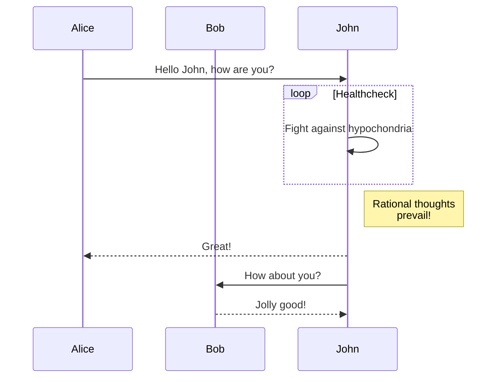
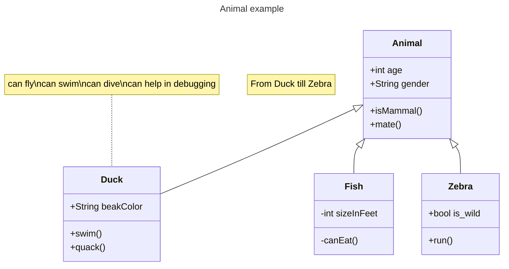
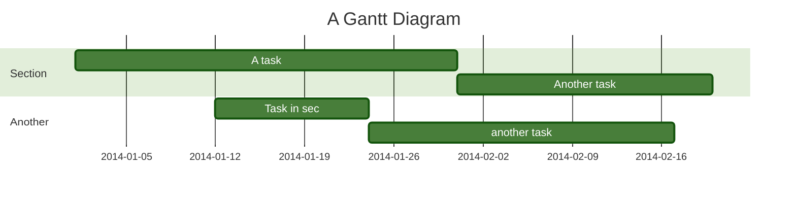

This article is a demo of diagrams, using the [mermaid](https://mermaid.js.org) and [goat](https://github.com/bep/goat) tools.

<!--more-->

## Mermaid

### Sequence Diagram Example

````

````


### Class Diagram Example

````

````


### Gantt Chart with specified theme

````

````


## GoAT

Click [here](https://github.com/bep/goat/tree/master/examples) to see more examples.

### Trees

````
```goat
      .               .                .               .--- 1          .-- 1     / 1
     / \              |                |           .---+            .-+         +
    /   \         .---+---.         .--+--.        |   '--- 2      |   '-- 2   / \ 2
   +     +        |       |        |       |    ---+            ---+          +
  / \   / \     .-+-.   .-+-.     .+.     .+.      |   .--- 3      |   .-- 3   \ / 3
 /   \ /   \    |   |   |   |    |   |   |   |     '---+            '-+         +
 1   2 3   4    1   2   3   4    1   2   3   4         '--- 4          '-- 4     \ 4

```
````

```goat
      .               .                .               .--- 1          .-- 1     / 1
     / \              |                |           .---+            .-+         +
    /   \         .---+---.         .--+--.        |   '--- 2      |   '-- 2   / \ 2
   +     +        |       |        |       |    ---+            ---+          +
  / \   / \     .-+-.   .-+-.     .+.     .+.      |   .--- 3      |   .-- 3   \ / 3
 /   \ /   \    |   |   |   |    |   |   |   |     '---+            '-+         +
 1   2 3   4    1   2   3   4    1   2   3   4         '--- 4          '-- 4     \ 4

```

### Dot Grids

````
```goat
  o o o o o  * * * * *  * * o o *    o o o      * * *      o o o     · * · · ·     · · ·
  o o o o o  * * * * *  o o o o *   o o o o    * * * *    * o * *    · * * · ·    · · · ·
  o o o o o  * * * * *  o * o o o  o o o o o  * * * * *  o o o o o   · o · · o   · · * * ·
  o o o o o  * * * * *  o * o o o   o o o o    * * * *    o * o o    · · · · o    · · * ·
  o o o o o  * * * * *  * * * * o    o o o      * * *      o * o     · · · · ·     · · *
```
````

```goat
  o o o o o  * * * * *  * * o o *    o o o      * * *      o o o     · * · · ·     · · ·
  o o o o o  * * * * *  o o o o *   o o o o    * * * *    * o * *    · * * · ·    · · · ·
  o o o o o  * * * * *  o * o o o  o o o o o  * * * * *  o o o o o   · o · · o   · · * * ·
  o o o o o  * * * * *  o * o o o   o o o o    * * * *    o * o o    · · · · o    · · * ·
  o o o o o  * * * * *  * * * * o    o o o      * * *      o * o     · · · · ·     · · *
```

### Large Nodes

````
```goat
   .---.       .-.        .-.       .-.                                       .-.
   | A +----->| 1 +<---->| 2 |<----+ 4 +------------------.                  | 8 |
   '---'       '-'        '+'       '-'                    |                  '-'
                           |         ^                     |                   ^
                           v         |                     v                   |
                          .-.      .-+-.        .-.      .-+-.      .-.       .+.       .---.
                         | 3 +---->| B |<----->| 5 +---->| C +---->| 6 +---->| 7 |<---->| D |
                          '-'      '---'        '-'      '---'      '-'       '-'       '---'
```
````

```goat
   .---.       .-.        .-.       .-.                                       .-.
   | A +----->| 1 +<---->| 2 |<----+ 4 +------------------.                  | 8 |
   '---'       '-'        '+'       '-'                    |                  '-'
                           |         ^                     |                   ^
                           v         |                     v                   |
                          .-.      .-+-.        .-.      .-+-.      .-.       .+.       .---.
                         | 3 +---->| B |<----->| 5 +---->| C +---->| 6 +---->| 7 |<---->| D |
                          '-'      '---'        '-'      '---'      '-'       '-'       '---'
```

### Circuits

````
```goat
                     ____                      *
                    |    |_____.---.           |
                    o     _____|    )----------)-------.
                   / \   |     '---'           |     __|__
                  /___\  |                     |     \   /
                    |    '-------------.       |      \ /
  A ----------------'                  |       |       o
       .-------------------.     o-----)-------'       |
       |                   |___.---.   |               |___.---.
  B ---*---.__.---.         ___|    )--*--.__..---.     ____)   )----- Y
            __|    o----*--'   '---'    ______))   )---'   '---'
  C -------'  '---'     |              |     ''---'
                        |              o
                        |             / \
                        |            /___\
                        |              |
                        '--------------'
```
````

```goat
                     ____                      *
                    |    |_____.---.           |
                    o     _____|    )----------)-------.
                   / \   |     '---'           |     __|__
                  /___\  |                     |     \   /
                    |    '-------------.       |      \ /
  A ----------------'                  |       |       o
       .-------------------.     o-----)-------'       |
       |                   |___.---.   |               |___.---.
  B ---*---.__.---.         ___|    )--*--.__..---.     ____)   )----- Y
            __|    o----*--'   '---'    ______))   )---'   '---'
  C -------'  '---'     |              |     ''---'
                        |              o
                        |             / \
                        |            /___\
                        |              |
                        '--------------'
```
